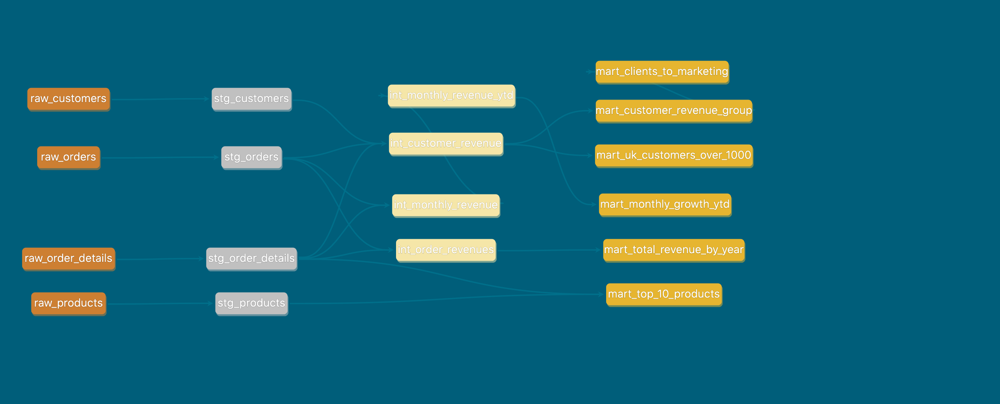
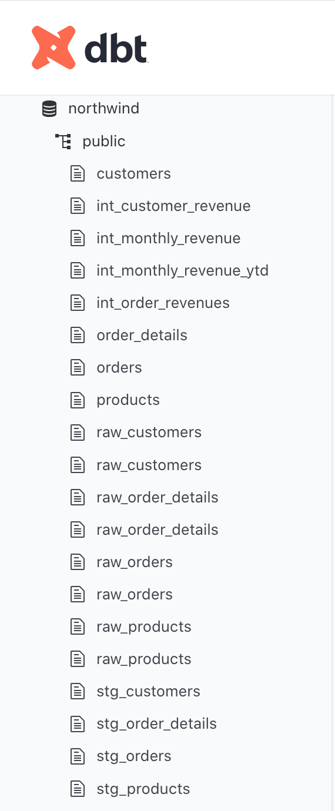
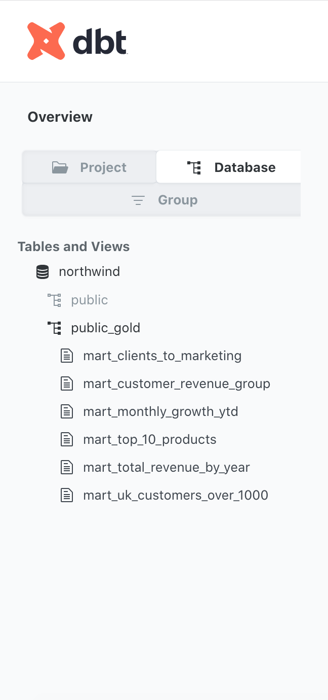

# 📊 Projeto de Analytics Engineering com dbt — Base Northwind

Este repositório apresenta um **projeto completo de Analytics Engineering** desenvolvido com **dbt** e **PostgreSQL**, utilizando a base clássica **Northwind** como fonte de dados. O objetivo é demonstrar, de ponta a ponta, boas práticas de **modelagem analítica, organização por camadas, versionamento e documentação**, com foco em **responder perguntas reais de negócio**.

---

## 🧭 1. Contexto do Projeto

A base **Northwind** é um banco de dados transacional amplamente utilizado para fins educacionais, contendo informações de:

* clientes
* pedidos
* itens de pedidos
* produtos
* valores de venda

Para este projeto:

* O **database Northwind foi criado e carregado no PostgreSQL**
* O PostgreSQL foi escolhido por ser um banco relacional amplamente utilizado no mercado e **totalmente compatível com dbt**
* A partir do Postgres, os dados foram integrados ao **dbt** para construção de um pipeline analítico moderno

🎯 **Objetivo principal:**

> Transformar dados transacionais em **modelos analíticos confiáveis**, documentados e prontos para consumo por ferramentas de BI e análises de negócio.

---

## 🏗️ 2. Arquitetura e Organização por Camadas

O projeto segue o padrão clássico de **Analytics Engineering**, separando responsabilidades em camadas bem definidas:

### 🔹 RAW (Bronze)

* Representa os dados o mais próximo possível da origem
* Consome diretamente as tabelas do PostgreSQL via `source()`
* Sem regras de negócio

**Exemplos:**

* `raw_customers`
* `raw_orders`
* `raw_order_details`

---

### 🔹 STAGING (Silver)

* Padronização e limpeza inicial
* Renomeação de colunas
* Garantia de chaves primárias e estrangeiras
* Tipagem e ajustes básicos

**Exemplos:**

* `stg_customers`
* `stg_orders`
* `stg_order_details`
* `stg_products`

---

### 🔹 INTERMEDIATE (Pré-Gold)

* Aplicação de **regras de negócio reutilizáveis**
* Consolidações intermediárias
* Preparação para múltiplos usos analíticos

**Exemplos:**

* `int_order_revenues`
* `int_customer_revenue`
* `int_monthly_revenue`
* `int_monthly_revenue_ytd`

---

### 🔹 MART (Gold)

* Modelos finais prontos para consumo
* Foco em **perguntas específicas de negócio**
* Utilizados diretamente em dashboards, relatórios e análises

**Exemplos:**

* `mart_total_revenue_by_year`
* `mart_monthly_growth_ytd`
* `mart_customer_revenue_group`
* `mart_top_10_products`
* `mart_uk_customers_over_1000`

---

## 📈 3. Perguntas de Negócio Respondidas

### 💰 Relatórios de Receita

**Perguntas:**

* Qual foi o **total de receitas no ano de 1997**?
* Como foi o **crescimento mensal da receita**?
* Qual o **acumulado YTD (Year-To-Date)** ao longo do ano?

**Models envolvidos:**

* `int_monthly_revenue`
* `int_monthly_revenue_ytd`
* `mart_total_revenue_by_year`
* `mart_monthly_growth_ytd`

---

### 👥 Segmentação de Clientes

**Perguntas:**

* Qual é o **valor total pago por cada cliente**?
* Como segmentar os clientes em **5 grupos de acordo com o valor pago**?
* Quais clientes pertencem aos **grupos 3, 4 e 5** para ações especiais de marketing?

**Models envolvidos:**

* `int_customer_revenue`
* `mart_customer_revenue_group`
* `mart_clients_to_marketing`

---

### 🏆 Top 10 Produtos Mais Vendidos

**Pergunta:**

* Quais são os **10 produtos mais vendidos**?

**Model envolvido:**

* `mart_top_10_products`

---

### 🇬🇧 Clientes do Reino Unido com Alto Faturamento

**Pergunta:**

* Quais clientes do **Reino Unido** pagaram **mais de 1000 dólares**?

**Model envolvido:**

* `mart_uk_customers_over_1000`

---

## 🧪 4. Qualidade, Testes e Documentação

O projeto aplica boas práticas de qualidade de dados:

* Testes de **not_null** e **unique** para chaves primárias
* Testes de **relationships** entre tabelas
* Documentação completa via `schema.yml`

📘 A documentação e o lineage podem ser visualizados com:

```bash
dbt docs generate
dbt docs serve
```

---

## ⚙️ 5. Ferramentas Utilizadas

* **PostgreSQL** — Banco de dados relacional
* **dbt (Data Build Tool)** — Transformação e modelagem analítica
* **Git & GitHub** — Versionamento e portfólio
* **Poetry** — Gerenciamento de dependências Python

---

## 🚀 6. Objetivo como Projeto de Portfólio

Este projeto foi desenvolvido com foco em:

* Demonstrar domínio de **Analytics Engineering**
* Aplicar boas práticas reais de mercado
* Mostrar capacidade de estruturar pipelines analíticos completos
* Servir como base para **entrevistas técnicas e discussões de arquitetura**

---

📌 **Autor:** Raphael Pylypiec
📌 **Tecnologias:** dbt • PostgreSQL • SQL • Git

## 📊 Lineage e Estrutura Analítica

### 🔗 Lineage (DAG do dbt)

Abaixo está o grafo de linhagem (DAG) gerado pelo dbt, que ilustra claramente o fluxo de dependências entre as camadas **raw → staging → intermediate → marts**, bem como a relação entre os modelos responsáveis por responder às perguntas de negócio.



As cores dos nós foram configuradas via `+docs.node_color` no `dbt_project.yml`, permitindo rápida identificação das camadas:

* **Raw (Bronze):** `#cd7f32`
* **Staging (Silver):** `#c0c0c0`
* **Intermediate (Pré-Gold):** amarelo claro
* **Mart (Gold):** `#e6b530`

---

### 🗄️ Estrutura de Schemas no Banco de Dados

A estrutura física no PostgreSQL reflete a organização lógica do projeto:

* O schema **`public`** contém as camadas `raw`, `stg` e `int`
* O schema **`public_gold`** é reservado exclusivamente para os **marts**, que representam tabelas prontas para consumo analítico

Essa separação segue boas práticas de arquitetura analítica, facilitando governança, controle de acesso e clareza para usuários finais.




O projeto utiliza intensivamente o **dbt docs** para documentar, validar e visualizar a linhagem completa dos dados.

### 🔗 Lineage Graph (DAG)

O gráfico de linhagem evidencia claramente a separação por camadas:

* **Raw (Bronze)**: ingestão fiel das tabelas do Northwind
* **Staging (Silver)**: padronização, tipagem e limpeza
* **Intermediate (Light Gold)**: regras de negócio reutilizáveis
* **Mart (Gold)**: tabelas finais orientadas a consumo analítico

> Cada camada foi configurada com `+docs: node_color` para facilitar a leitura visual no DAG.

### 🗄️ Estrutura de Schemas no PostgreSQL

* `public`: dados raw, staging e intermediate
* `public_gold`: camada mart, pronta para consumo por BI, Analytics e Marketing

Essa separação simula um ambiente analítico real, facilitando governança e controle de acesso.

---

## ▶️ Como Executar o Projeto Localmente

Esta seção permite que qualquer pessoa execute o projeto em sua própria máquina.

### 1️⃣ Pré-requisitos

* **Python** >= 3.9
* **Poetry**
* **PostgreSQL**
* **Git**

### 2️⃣ Clonar o Repositório

```bash
git clone <url-do-repositorio>
cd meu_projeto_dbt
```

### 3️⃣ Criar Ambiente Python com Poetry

```bash
poetry install
poetry shell
```

### 4️⃣ Criar o Banco Northwind no PostgreSQL

* Crie um banco chamado `northwind`
* Importe o dataset Northwind (customers, orders, order_details, products, etc.)
* As tabelas devem estar no schema `public`

### 5️⃣ Configurar o profiles.yml do dbt

Arquivo: `~/.dbt/profiles.yml`

```yaml
meu_projeto_dbt:
  target: dev
  outputs:
    dev:
      type: postgres
      host: localhost
      user: <seu_usuario>
      password: <sua_senha>
      port: 5432
      dbname: northwind
      schema: public
```

### 6️⃣ Validar Conexão

```bash
poetry run dbt debug
```

### 7️⃣ Executar os Models

```bash
poetry run dbt run
```

### 8️⃣ Executar Testes de Qualidade

```bash
poetry run dbt test
```

### 9️⃣ Gerar Documentação

```bash
poetry run dbt docs generate
poetry run dbt docs serve
```

A documentação ficará disponível em:

```
http://localhost:8080
```

---

## 🎯 Objetivo do Projeto

Este projeto foi desenvolvido com foco em **portfólio profissional**, demonstrando:

* Modelagem analítica em camadas
* Aplicação de boas práticas de dbt
* Criação de métricas de negócio reutilizáveis
* Testes de qualidade e documentação
* Organização próxima à realidade de ambientes corporativos

Ele pode ser facilmente estendido para ferramentas de BI como Power BI, Looker ou Tableau.
